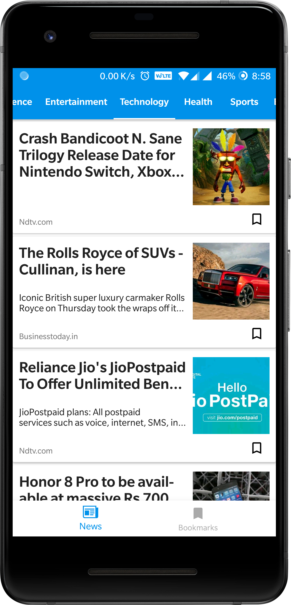
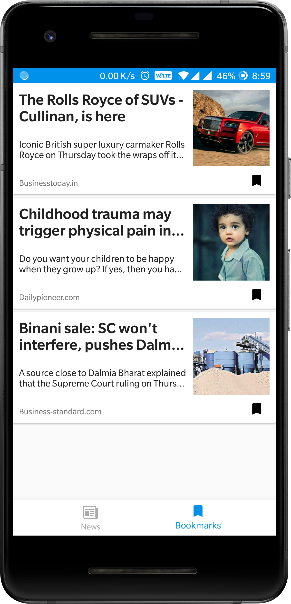

# [NewsPin](https://bit.ly/2Iy3jwz): Stay updated with latest news
<p align="center"></p>

NewsPin is a news app powered by <a href="https://newsapi.org/"><b>NewsAPI.org</b></a> which shows top news of 6 different categories from leading newspaper of India.

 &nbsp;&nbsp;&nbsp;
 &nbsp;&nbsp;&nbsp;
 &nbsp;&nbsp;&nbsp;

# Download

**NewsPin** can be download from [Google Play](https://bit.ly/2Iy3jwz):

<a href="https://bit.ly/2Iy3jwz" target="_blank"></a>

# Libraries used
- [**Kotlin**](https://github.com/JetBrains/kotlin) 
- [**Retrofit**](https://github.com/square/retrofit) for constructing the REST API
- [**Glide**](https://github.com/bumptech/glide) for loading images
- [**Fabric**](https://fabric.io/kits/android/crashlytics) analytics & crash reporting.
- [**Kotlin Coroutines**](https://github.com/Kotlin/kotlinx.coroutines) for retrofit.
- [**Room**](https://developer.android.com/topic/libraries/architecture/room) for persistence.
- **Android Support Libraries**

## Build
### Open the project in Android Studio
```
git clone https://github.com/HimanshuHP/NewsPin.git
```
- Place your NewsAPI key in [gradle.properties](https://github.com/HimanshuHP/NewsPin/blob/master/gradle.properties) file.<br/>
- Place your fabric key in [AndroidManifest.xml](https://github.com/HimanshuHP/NewsPin/blob/master/app/src/main/AndroidManifest.xml) file.
